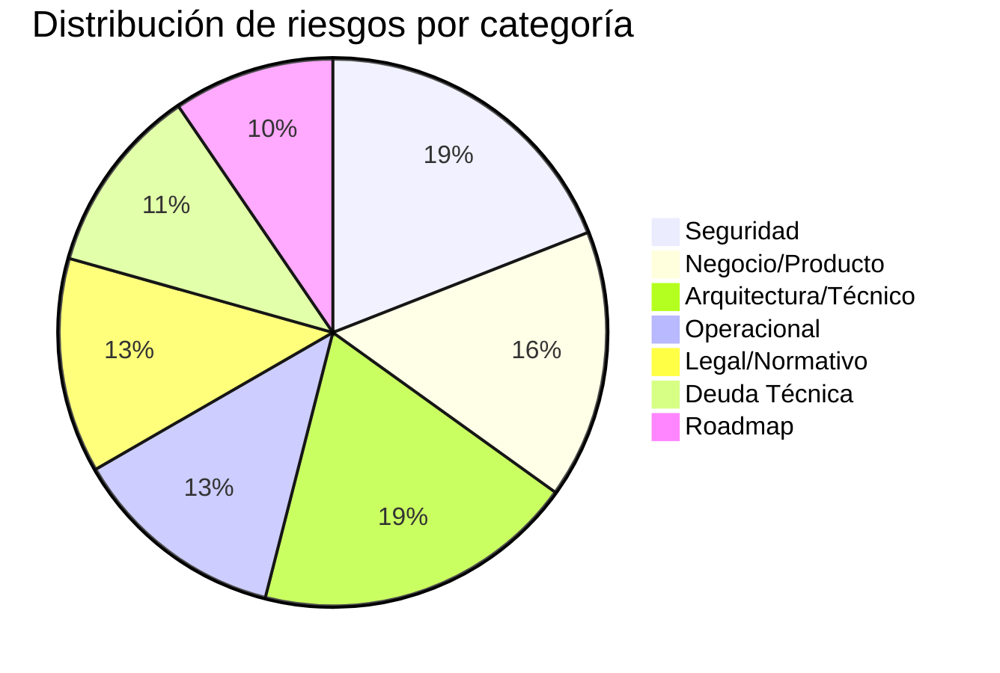

# Matriz de Riesgos — Aplicación Colegio (SaaS Escolar Chile)

Fecha de elaboración: 2026-03-28
Versión: 1.0

---

## Convenciones

| Probabilidad | Descripción |
|---|---|
| **Alta** | Es esperable que ocurra si no se mitiga activamente |
| **Media** | Puede ocurrir bajo condiciones probables |
| **Baja** | Poco probable pero posible |

| Impacto | Descripción |
|---|---|
| **Crítico** | Pérdida de datos, exposición legal, caída total del servicio |
| **Alto** | Funcionalidad crítica degradada, riesgo normativo, pérdida de clientes |
| **Medio** | Degradación parcial, reprocesos, retraso en roadmap |
| **Bajo** | Inconveniente menor, corrección rápida, sin impacto externo |

| Nivel de riesgo | Fórmula |
|---|---|
| 🔴 **Crítico** | Probabilidad Alta + Impacto Crítico/Alto |
| 🟠 **Alto** | Probabilidad Media/Alta + Impacto Alto/Medio |
| 🟡 **Medio** | Probabilidad Media + Impacto Medio/Bajo |
| 🟢 **Bajo** | Probabilidad Baja + Impacto Bajo |

---

## 1. Riesgos de Seguridad

| # | Riesgo | Probabilidad | Impacto | Nivel | Categoría | Mitigación existente | Mitigación propuesta | Responsable | Estado |
|---|---|---|---|---|---|---|---|---|---|
| S-01 | Fuga de datos entre tenants (cross-tenant data leak) | Media | Crítico | 🔴 Crítico | Seguridad / Multi-tenant | TenantMiddleware, filtro obligatorio por `colegio_id` en servicios | Auditoría automatizada periódica de queries sin filtro tenant; tests negativos de aislamiento en cada endpoint nuevo | Equipo backend | Mitigación parcial |
| S-02 | Escalación de privilegios por bypass de capabilities | Baja | Crítico | 🟠 Alto | Seguridad / Autorización | PolicyService capability-first, eliminación progresiva de checks por nombre de rol | Completar eliminación de todos los checks legacy por nombre de rol; prueba de regresión de permisos automatizada en CI | Equipo backend | Mitigación parcial |
| S-03 | Ataques de fuerza bruta a autenticación | Media | Alto | 🟠 Alto | Seguridad / Autenticación | Django-axes (5 intentos, 1h cooloff), lockout por username+IP | Activar hCaptcha en producción (`HCAPTCHA_ENABLED=True`); monitoreo de tasa de bloqueos por IP en dashboard operacional | Equipo infraestructura | Mitigación parcial |
| S-04 | Exposición de SECRET_KEY o credenciales en repositorio | Baja | Crítico | 🟠 Alto | Seguridad / Configuración | Uso de `python-decouple` para secrets vía `.env` | Implementar escaneo de secretos en CI (git-secrets / truffleHog); rotación periódica programada de SECRET_KEY | Equipo DevOps | Mitigación parcial |
| S-05 | Vulnerabilidades en dependencias de terceros | Media | Alto | 🟠 Alto | Seguridad / Dependencias | N/A | Integrar `pip-audit` o `safety` en pipeline CI; alertas automáticas de Dependabot/Renovate; policy de actualización mensual | Equipo DevOps | Sin mitigación |
| S-06 | JWT comprometido permite acceso prolongado | Baja | Alto | 🟡 Medio | Seguridad / Tokens | Access token 30 min, refresh 7 días con rotación y blacklist | Considerar reducir refresh a 1-3 días; implementar revocación inmediata por admin en caso de incidente | Equipo backend | Mitigación parcial |
| S-07 | Inyección SQL o XSS en inputs sin sanitizar | Baja | Crítico | 🟠 Alto | Seguridad / Aplicación | ORM Django previene SQL injection nativa; `SECURE_BROWSER_XSS_FILTER`, `X_FRAME_OPTIONS=DENY` | Auditoría de queries raw SQL si existen; validación exhaustiva en serializers DRF; CSP headers | Equipo backend | Mitigación parcial |
| S-08 | Upload de archivos maliciosos | Baja | Alto | 🟡 Medio | Seguridad / Archivos | Lista blanca de extensiones y MIME types en settings; límite de 50MB | Escaneo antivirus de archivos subidos; almacenamiento en bucket externo (S3) sin ejecución; validación de contenido real vs extensión | Equipo backend | Mitigación parcial |
| S-09 | Acceso no autorizado a datos confidenciales de estudiantes (ficha psicológica) | Media | Crítico | 🔴 Crítico | Seguridad / Privacidad | Capability `STUDENT_VIEW_CONFIDENTIAL` exclusiva para psicólogo orientador; auditoría de accesos | Alertas en tiempo real cuando se accede a datos confidenciales; registro inmutable de cada consulta con justificación | Equipo backend | Mitigación parcial |
| S-10 | SESSION_COOKIE_SECURE=False en producción | Baja | Alto | 🟡 Medio | Seguridad / Configuración | Bloque `if not DEBUG` activa cookies seguras y HSTS | Verificar que la variable `DEBUG=False` esté correctamente configurada en todos los entornos de producción; checklist pre-deploy | Equipo DevOps | Mitigación existente |
| S-11 | Ausencia de rate limiting granular por endpoint crítico | Media | Medio | 🟡 Medio | Seguridad / API | Rate limiting global de 120/min por usuario; burst de 10/min en auth | Implementar throttle diferenciado para endpoints sensibles (cambio de contraseña, exportación de datos, emisión de certificados) | Equipo backend | Mitigación parcial |
| S-12 | Falta de cifrado de datos sensibles en reposo | Media | Crítico | 🔴 Crítico | Seguridad / Datos | N/A | Cifrar campos sensibles (RUT, datos médicos, fichas psicológicas) a nivel de aplicación o base de datos; cifrado de backups | Equipo backend + DBA | Sin mitigación |

---

## 2. Riesgos Legales y Normativos

| # | Riesgo | Probabilidad | Impacto | Nivel | Categoría | Mitigación existente | Mitigación propuesta | Responsable | Estado |
|---|---|---|---|---|---|---|---|---|---|
| L-01 | Incumplimiento de Ley 19.628 (Protección de Datos Personales Chile) | Media | Crítico | 🔴 Crítico | Legal / Privacidad | Multi-tenant con aislamiento, auditoría de accesos | Política de privacidad publicada; consentimiento informado de apoderados; mecanismo de eliminación de datos (derecho al olvido); DPO designado | Dirección + Legal | Mitigación parcial |
| L-02 | Incumplimiento de requisitos Superintendencia de Educación para libro de clases | Media | Alto | 🟠 Alto | Legal / Normativo | RegistroClase implementado con firma e inmutabilidad; exportaciones normativas (json/csv/xlsx/pdf/sige) | Completar checklist formal de aceptación normativa; validación con un colegio piloto; mantener alineamiento con circulares actualizadas | Equipo producto | Mitigación parcial |
| L-03 | Incumplimiento Decreto 67 (evaluación y promoción) | Media | Alto | 🟠 Alto | Legal / Normativo | Fase 1 en cierre avanzado con compliance Decreto 67 | Validación formal contra texto vigente del decreto; certificación con asesor curricular externo; tests automatizados de reglas de promoción | Equipo producto | Mitigación parcial |
| L-04 | Manejo inadecuado de datos de menores de edad | Alta | Crítico | 🔴 Crítico | Legal / Protección de menores | Aislamiento por capabilities; roles diferenciados | Consentimiento parental explícito documentado; política clara de retención y eliminación de datos de menores; auditoría especial para accesos a perfiles de estudiantes | Dirección + Legal | Mitigación parcial |
| L-05 | Falta de plan de respuesta a incidentes de datos | Alta | Alto | 🔴 Crítico | Legal / Incidente | AuditoriaMiddleware registra eventos | Elaborar plan formal de respuesta a incidentes (72h para notificar); designar responsable de incidentes; simulacro anual | Dirección + DevOps | Sin mitigación |
| L-06 | Facturación electrónica no conforme a SII | Media | Alto | 🟠 Alto | Legal / Tributario | Módulo de boletas implementado | Integración con sistema de facturación electrónica autorizado por SII; validación de formato DTE; mantener DTEs respaldados por 6 años | Equipo financiero | Sin mitigación |
| L-07 | Incumplimiento Ley SEP (N° 20.248) en módulo de estudiantes prioritarios | Media | Medio | 🟡 Medio | Legal / Normativo | Modelo EstudiantePrioritario diseñado (Fase 3 del plan) | Implementar módulo SEP completo; validar clasificaciones contra datos JUNAEB; generar reportes exigidos por la ley | Equipo producto | Sin mitigación |
| L-08 | Falta de política de retención de datos y backups | Media | Alto | 🟠 Alto | Legal / Operacional | Directorio de backups existe | Definir período de retención por tipo de dato; automatizar purga de datos expirados; backup georredundante cifrado; pruebas de restauración trimestrales | Equipo DevOps | Mitigación parcial |

---

## 3. Riesgos Arquitectónicos y Técnicos

| # | Riesgo | Probabilidad | Impacto | Nivel | Categoría | Mitigación existente | Mitigación propuesta | Responsable | Estado |
|---|---|---|---|---|---|---|---|---|---|
| A-01 | Regresión funcional por convivencia legacy (templates Django) + API v1 | Alta | Alto | 🔴 Crítico | Arquitectura / Migración | Tests de regresión; cambios incrementales; contratos API estables | Ampliar cobertura de tests de regresión; establecer golden tests para rutas críticas; feature flags para migración gradual | Equipo backend | Mitigación parcial |
| A-02 | Divergencia entre raíz del repo y carpeta anidada `Aplicacion_Colegio/` | Media | Medio | 🟡 Medio | Arquitectura / Repositorio | Guard CI `check_nested_mirror_changes.py`; CI bloquea cambios en carpeta anidada por defecto | Completar consolidación para eliminar carpeta anidada; CI gate que falla si hay diferencias no autorizadas | Equipo DevOps | Mitigación parcial |
| A-03 | Base de datos SQLite en desarrollo no refleja comportamiento de PostgreSQL en producción | Media | Medio | 🟡 Medio | Arquitectura / Database | Soporte para PostgreSQL y SQL Server en settings | Desarrollo local con PostgreSQL vía Docker Compose; tests de integración ejecutados contra PostgreSQL; documentar diferencias de comportamiento | Equipo backend | Mitigación parcial |
| A-04 | Acoplamiento de lógica de negocio en vistas (views) | Media | Medio | 🟡 Medio | Arquitectura / Diseño | Regla de proyecto: no llevar lógica a views; capa de servicios existente | Lint rule o review checklist que detecte lógica de negocio en views; refactor incremental de vistas legacy | Equipo backend | Mitigación parcial |
| A-05 | Falta de observabilidad y monitoreo en producción | Alta | Alto | 🔴 Crítico | Arquitectura / Operaciones | Logging con RotatingFileHandler; `OperationalMetricsMiddleware`; `SlowRequestLoggerMiddleware` | Integrar APM (Sentry, New Relic o Datadog); dashboard de métricas operacionales (latencia, errores, saturación); alertas automáticas por anomalías | Equipo DevOps | Mitigación parcial |
| A-06 | WebSockets/Channels sin estrategia de reconexión en cliente | Media | Medio | 🟡 Medio | Arquitectura / Real-time | Django Channels + Redis configurado | Implementar heartbeat/ping en cliente; reconexión exponencial con backoff; fallback a polling cuando WebSocket falla | Equipo frontend | Sin mitigación |
| A-07 | Migración de base de datos destructiva en producción | Baja | Crítico | 🟠 Alto | Arquitectura / Database | Migraciones Django estándar | Revisión manual obligatoria de migraciones antes de producción; backup automático pre-migración; migraciones reversibles; prohibir `RunSQL` sin rollback | Equipo backend + DBA | Sin mitigación |
| A-08 | Rendimiento degradado con crecimiento de datos (N+1 queries, sin índices) | Media | Alto | 🟠 Alto | Arquitectura / Rendimiento | `QueryCountDebugMiddleware` en DEBUG | Análisis periódico de slow queries; `select_related`/`prefetch_related` audit; índices estratégicos en campos de filtro frecuente; paginación cursor-based ya implementada | Equipo backend | Mitigación parcial |
| A-09 | Ausencia de entorno de staging | Alta | Medio | 🟠 Alto | Arquitectura / Despliegue | N/A | Crear entorno de staging idéntico a producción; pipeline CI/CD con deploy automático a staging antes de producción; smoke tests post-deploy | Equipo DevOps | Sin mitigación |
| A-10 | Frontend React y Django templates evolucionan en paralelo sin sincronización | Media | Medio | 🟡 Medio | Arquitectura / Frontend | Convivencia controlada documentada | Definir roadmap claro de migración de templates a React; evitar duplicación de componentes; feature flags por módulo para transición gradual | Equipo frontend | Mitigación parcial |
| A-11 | Caché sin estrategia de invalidación coherente | Media | Medio | 🟡 Medio | Arquitectura / Caché | Redis y LocMem configurados con timeouts | Implementar invalidación por señales Django en operaciones de escritura; documentar política de caché por módulo; evitar caché de datos sensibles | Equipo backend | Sin mitigación |
| A-12 | Falta de CI/CD pipeline completo (build → test → staging → producción) | Alta | Alto | 🔴 Crítico | Arquitectura / DevOps | Guard de integridad, pytest local, flake8 | Configurar pipeline CI/CD completo (GitHub Actions / GitLab CI); stages: lint → test → build → deploy staging → smoke → deploy prod | Equipo DevOps | Mitigación parcial |

---

## 4. Riesgos Operacionales

| # | Riesgo | Probabilidad | Impacto | Nivel | Categoría | Mitigación existente | Mitigación propuesta | Responsable | Estado |
|---|---|---|---|---|---|---|---|---|---|
| O-01 | Caída del servicio Redis (afecta WebSockets, caché, notificaciones) | Media | Alto | 🟠 Alto | Operacional / Infraestructura | Fallback InMemory en desarrollo; Redis para producción | Redis con réplica y failover automático (Redis Sentinel o ElastiCache); monitoreo de salud de Redis; degradación graceful cuando Redis no está disponible | Equipo DevOps | Sin mitigación |
| O-02 | Pérdida de backups o backup corrupto no detectado | Media | Crítico | 🔴 Crítico | Operacional / Datos | Directorio de backups local | Backups automáticos diarios a ubicación remota; verificación de integridad de backup; prueba de restauración trimestral documentada; retención mínima 30 días | Equipo DevOps | Mitigación parcial |
| O-03 | Servicio de email SMTP falla y notificaciones no se entregan | Media | Medio | 🟡 Medio | Operacional / Comunicaciones | `EMAIL_TIMEOUT=10`; console backend en desarrollo | Cola de reintentos para emails fallidos; proveedor SMTP con SLA (SendGrid/SES); monitoreo de tasa de entrega; fallback a sistema de notificaciones interno | Equipo DevOps | Sin mitigación |
| O-04 | Push notifications Firebase (FCM) no configurado o credenciales expiradas | Alta | Medio | 🟠 Alto | Operacional / Mobile | Variables `FCM_CREDENTIALS_FILE` / `FCM_CREDENTIALS_JSON` definidas pero potencialmente vacías | Validar credenciales FCM en health check de startup; alerta si credenciales expiran en < 30 días; fallback documentado a notificaciones web | Equipo backend | Sin mitigación |
| O-05 | Logs crecen sin control y agotan espacio en disco | Media | Medio | 🟡 Medio | Operacional / Infraestructura | RotatingFileHandler con maxBytes (10MB) y backupCount | Centralización de logs (ELK, CloudWatch, o similar); política de retención; alertas de espacio en disco; rotación verificada en producción | Equipo DevOps | Mitigación parcial |
| O-06 | Ausencia de health check endpoint para balanceadores/orquestadores | Alta | Medio | 🟠 Alto | Operacional / Despliegue | N/A | Crear endpoint `/health/` que valide DB, Redis, y servicios críticos; integrar con balanceador de carga y alertas de uptime | Equipo backend | Sin mitigación |
| O-07 | Tiempo de inactividad durante despliegues (zero-downtime no implementado) | Media | Medio | 🟡 Medio | Operacional / Despliegue | Docker Compose para despliegue | Implementar blue-green o rolling deployments; migraciones no-blocking; pre-warming de caché post-deploy | Equipo DevOps | Sin mitigación |
| O-08 | Falta de documentación operativa para on-call/incidentes | Alta | Alto | 🔴 Crítico | Operacional / Procesos | `RUNBOOK_GATEWAY_BACKUP.md` existe | Crear runbooks para cada componente crítico (DB, Redis, API, WebSockets); playbook de incidentes con escalación; documentar procedimientos de rollback | Equipo DevOps | Mitigación parcial |

---

## 5. Riesgos de Negocio y Producto

| # | Riesgo | Probabilidad | Impacto | Nivel | Categoría | Mitigación existente | Mitigación propuesta | Responsable | Estado |
|---|---|---|---|---|---|---|---|---|---|
| N-01 | Competencia SaaS escolar en Chile con funcionalidades más avanzadas | Alta | Alto | 🔴 Crítico | Negocio / Mercado | Roadmap diferenciado: alertas tempranas, IA curricular, libro digital | Acelerar entrega de Fases 1-3 del roadmap Chile; validar funcionalidades con colegios piloto; foco en diferenciadores (alertas tempranas, IA) | Dirección + Producto | Mitigación parcial |
| N-02 | Adopción lenta por resistencia al cambio en comunidad escolar | Alta | Alto | 🔴 Crítico | Negocio / Adopción | Portal apoderado como puerta de entrada; UX por rol | Programa de capacitación para cada rol; documentación de usuario final; soporte dedicado en período de onboarding; periodo de prueba gratuito | Dirección + Soporte | Sin mitigación |
| N-03 | Modelo de suscripción no validado comercialmente | Alta | Alto | 🔴 Crítico | Negocio / Monetización | Módulo `subscriptions` implementado con SubscriptionMiddleware | Validar pricing con 3-5 colegios piloto antes de lanzamiento; definir planes por tipo de colegio; ofrecer plan freemium para tracción inicial | Dirección | Sin mitigación |
| N-04 | App móvil no entregada a tiempo para período escolar (marzo) | Alta | Alto | 🔴 Crítico | Negocio / Timeline | Contrato API Mobile MVP v1 publicado; smoke tests 12/12 passed | Definir MVP mínimo viable para marzo; lanzar versión web responsive como alternativa inmediata; priorizar flujos diarios (asistencia, notas, comunicados) | Equipo producto | Mitigación parcial |
| N-05 | Integración de pagos online (Webpay/MercadoPago) con alta complejidad técnica y regulatoria | Media | Alto | 🟠 Alto | Negocio / Financiero | Módulo de pagos y becas implementado a nivel modelo | Comenzar certificación con Transbank/MercadoPago temprano (toma 2-4 meses); implementar modo sandbox primero; plan B: link de pago externo | Equipo backend + Finanzas | Sin mitigación |
| N-06 | Dependencia de un solo desarrollador/equipo pequeño (bus factor = 1) | Alta | Crítico | 🔴 Crítico | Negocio / Equipo | Documentación técnica extensa; reglas de proyecto documentadas | Documentar decisiones de arquitectura; pair programming; mantener documentación actualizada; considerar contratación estratégica | Dirección | Mitigación parcial |
| N-07 | Falta de SLA definido para clientes | Alta | Alto | 🔴 Crítico | Negocio / Servicio | N/A | Definir SLA (disponibilidad 99.5%, tiempo de respuesta a incidentes, horario de soporte); implementar monitoreo para cumplimiento | Dirección | Sin mitigación |
| N-08 | Pérdida de confianza por incidente de seguridad o datos | Baja | Crítico | 🟠 Alto | Negocio / Reputación | Auditoría, capabilities, multi-tenant | Certificación de seguridad (ISO 27001 o similar para edutech); seguro de responsabilidad civil; comunicación transparente de incidentes | Dirección + Legal | Sin mitigación |
| N-09 | Escalabilidad del modelo multi-tenant con crecimiento de colegios | Media | Alto | 🟠 Alto | Negocio / Escala | Aislamiento por `colegio_id` (shared DB) | Evaluar sharding o DB-per-tenant si se superan 100+ colegios; benchmark de rendimiento con carga simulada; plan de migración documentado | Equipo backend + DBA | Sin mitigación |
| N-10 | Falta de analítica de uso del producto (product analytics) | Alta | Medio | 🟠 Alto | Negocio / Producto | OperationalMetricsMiddleware para métricas técnicas | Integrar herramienta de product analytics (Mixpanel, Amplitude, PostHog); trackear adopción por módulo, por rol, por colegio; métricas de retención | Producto | Sin mitigación |

---

## 6. Riesgos de Deuda Técnica

| # | Riesgo | Probabilidad | Impacto | Nivel | Categoría | Mitigación existente | Mitigación propuesta | Responsable | Estado |
|---|---|---|---|---|---|---|---|---|---|
| D-01 | Cobertura de tests insuficiente para refactors seguros | Media | Alto | 🟠 Alto | Deuda Técnica / Testing | Pipeline con pytest; regla de test por cambio | Establecer umbral mínimo de cobertura en CI (e.g., 70%); identificar módulos sin cobertura y priorizar; mutation testing para validar calidad de tests | Equipo backend | Mitigación parcial |
| D-02 | Alias legacy de roles aún activos en el sistema | Media | Medio | 🟡 Medio | Deuda Técnica / Legacy | Normalización de roles actualizada; alias temporales mantenidos | Planificar fecha de deprecación de alias; migrar todos los usos internos; eliminar alias en release mayor con migración automática | Equipo backend | Mitigación parcial |
| D-03 | Templates Django con lógica de presentación compleja difícil de mantener | Alta | Medio | 🟠 Alto | Deuda Técnica / Frontend | Migración progresiva a React | Priorizar migración de templates más complejos; evitar agregar funcionalidad nueva en templates Django; documentar dependencias de cada template | Equipo frontend | Mitigación parcial |
| D-04 | Ausencia de documentación de API generada automáticamente (OpenAPI/Swagger) | Alta | Medio | 🟠 Alto | Deuda Técnica / Documentación | Documentos de contrato manuales en `docs/` | Integrar `drf-spectacular` o `drf-yasg` para generación automática de OpenAPI schema; publicar documentación interactiva; validar contratos con schema tests | Equipo backend | Sin mitigación |
| D-05 | Migraciones Django acumuladas sin squash | Media | Bajo | 🟢 Bajo | Deuda Técnica / Database | Migraciones estándar Django | Squash de migraciones por app cuando superen 20+; documentar dependencias entre apps; ejecutar `showmigrations` en CI | Equipo backend | Sin mitigación |
| D-06 | Configuración hardcodeada que debería ser por colegio (escala de notas, umbrales) | Media | Medio | 🟡 Medio | Deuda Técnica / Configurabilidad | Modelo ConfiguracionAcademica diseñado pero no implementado completamente | Implementar ConfiguracionAcademica por colegio; migrar umbrales hardcoded a configuración dinámica; UI de administración para configuración | Equipo backend | Mitigación parcial |
| D-07 | Código duplicado entre carpeta raíz y carpeta anidada | Media | Medio | 🟡 Medio | Deuda Técnica / Estructura | CI guard; consolidación parcial completada | Completar consolidación eliminando la carpeta anidada como fuente de ejecución; documentar estructura canónica final | Equipo DevOps | Mitigación parcial |

---

## 7. Riesgos del Roadmap por Fase

| # | Riesgo | Fase | Probabilidad | Impacto | Nivel | Mitigación propuesta |
|---|---|---|---|---|---|---|
| R-01 | Requisitos normativos del libro de clases cambian antes de completar Fase 1 | Fase 1 | Media | Alto | 🟠 Alto | Monitoreo activo de circulares MINEDUC; diseño flexible con reglas configurables; relación con asesor normativo |
| R-02 | Contrato API Mobile MVP insuficiente para UX real de la app | Fase 2 | Alta | Alto | 🔴 Crítico | Prototipo de UX antes de definir contrato final; iteración rápida con feedback de usuarios reales; versionado de API |
| R-03 | Dependencia entre fases genera efecto cascada de retrasos | Fases 3-5 | Alta | Alto | 🔴 Crítico | Paralelizar trabajo donde sea posible; entregables incrementales por fase; MVP por fase con scope reducido si hay retrasos |
| R-04 | Integración IA curricular (Fase 4) con costos operativos no previstos | Fase 4 | Media | Medio | 🟡 Medio | Benchmark de costos API (OpenAI/Claude) antes de implementar; límites de uso por colegio; caché agresivo de respuestas; modelo freemium para IA |
| R-05 | Panel sostenedor (Fase 5) requiere acceso cross-tenant no previsto en arquitectura | Fase 5 | Media | Alto | 🟠 Alto | Diseñar capability `MULTI_TENANT_VIEW` desde ahora; sandbox de acceso cross-tenant aislado del modelo principal; auditoría reforzada |
| R-06 | Módulo de convivencia escolar requiere cumplir con protocolos ministeriales complejos | Fase 5 | Media | Alto | 🟠 Alto | Consultar protocolos vigentes de convivencia (Circular 482 Supereduc); diseñar modelo flexible; validar con encargado de convivencia de colegio piloto |

---

## Resumen Ejecutivo

### Distribución de riesgos por nivel

| Nivel | Cantidad | Porcentaje |
|---|---|---|
| 🔴 Crítico | 19 | 36% |
| 🟠 Alto | 21 | 40% |
| 🟡 Medio | 12 | 22% |
| 🟢 Bajo | 1 | 2% |
| **Total** | **53** | **100%** |

### Top 10 riesgos prioritarios (acción inmediata recomendada)

| Prioridad | ID | Riesgo | Acción clave |
|---|---|---|---|
| 1 | S-01 | Fuga de datos cross-tenant | Auditoría de queries + tests negativos en cada endpoint |
| 2 | L-04 | Datos de menores de edad | Consentimiento parental + política de retención |
| 3 | N-06 | Bus factor = 1 | Documentación + pair programming + contratación |
| 4 | L-05 | Sin plan de respuesta a incidentes | Elaborar plan formal con plazos y responsables |
| 5 | A-12 | CI/CD pipeline incompleto | Pipeline completo: lint → test → staging → prod |
| 6 | S-12 | Sin cifrado de datos en reposo | Cifrar campos sensibles (RUT, datos médicos) |
| 7 | N-03 | Modelo de suscripción no validado | Piloto con 3-5 colegios |
| 8 | S-09 | Acceso no autorizado a datos confidenciales | Alertas en tiempo real + log inmutable |
| 9 | A-05 | Falta de observabilidad en producción | APM + dashboard de métricas + alertas |
| 10 | O-02 | Backups sin verificación | Backups remotos + prueba de restauración trimestral |

### Categorías con mayor concentración de riesgo

---

## Plan de Revisión

| Frecuencia | Acción |
|---|---|
| **Mensual** | Revisión de estado de mitigaciones en curso y actualización de probabilidades |
| **Trimestral** | Revisión completa de la matriz; incorporación de riesgos nuevos; eliminación de riesgos resueltos |
| **Por fase del roadmap** | Evaluación de riesgos específicos de la fase antes de iniciar desarrollo |
| **Post-incidente** | Actualización inmediata con lecciones aprendidas |

---

*Documento generado como parte de la documentación del proyecto Aplicación Colegio. Debe mantenerse actualizado como documento vivo.*
