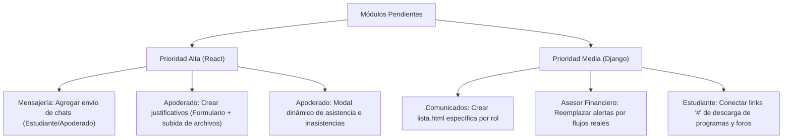

# Auditoría de Módulos sin Interacción y Pendientes
**Fecha de Auditoría:** 2026-05-30
**Estado General:** Integrado y Parcialmente Completo

Este reporte presenta un análisis exhaustivo y sistemático de las interfaces del **Estudiante**, **Profesor** y **Apoderado** en las dos arquitecturas del proyecto: el frontend legacy en **Django Templates** y la SPA moderna en **React**. El objetivo es identificar qué vistas y botones aún permanecen como maquetas estáticas, usan enlaces vacíos (`#`), activan alertas de simulación o carecen de lógica funcional en el backend.

---

## 1. Portal del Estudiante

### A. SPA React (`frontend-react/src/features/estudiante/`)
* **Mensajería Interna (`StudentSelfPage.jsx`):**
  > [!WARNING]
  > **Sin Lógica de Envío de Mensajes**: Aunque el panel de mensajes permite seleccionar una conversación y ver el historial de los últimos 15 mensajes recibidos, **no existe ningún formulario de entrada ni botón de envío** para escribir o responder. El estudiante está limitado a un rol de solo lectura en el chat.
* **Módulos de Finanzas (`StudentSelfPage.jsx`):**
  * La vista muestra tablas muy detalladas de saldos de cuenta y el desglose de cuotas pendientes con becas aplicadas. Sin embargo, a diferencia del legacy Django, en React **no existen botones ni flujos interactivos para simular pagos (Transbank/Webpay)**.
* **Descarga de Certificados (`StudentSelfPage.jsx`):**
  * Vinculado de manera correcta a los endpoints de descarga del backend (`/pdf/certificado-notas/`, `/pdf/certificado-matricula/`, `/pdf/informe-rendimiento/`). Operativo y funcional.

### B. Legacy Django (`frontend_django/templates/estudiante/`)
* **Calendario de Tareas (`calendario_tareas.html`):**
  * **Alertas "Coming Soon"**:
    * Botón de filtrado: Lanza un alert indicando `Filter functionality coming soon!`.
    * Botón de agregar evento: Lanza un alert indicando `Add event functionality - redirect to create task`.
    * Botón de exportación: Lanza un alert indicando `Export calendar functionality coming soon!`.
* **Detalle de Clase (`detalle_clase.html`):**
  * **Enlaces de descarga y recursos estáticos (`href="#"`)**:
    * El enlace para `Descargar Programa Completo` redirige a `#`.
    * Enlaces auxiliares de `📚 Bibliografía del Curso`, `💬 Foro de Discusión`, y `❓ Preguntas Frecuentes` son puramente visuales y apuntan a `#`.
* **Mis Evaluaciones (`mis_evaluaciones.html`):**
  * **Alertas informativas en lugar de ventanas modales**:
    * Botón `Iniciar Evaluación`: Lanza un alert de texto explicando que la prueba debe realizarse mediante el portal en React, bloqueando la acción nativa en Django.
    * Botón `Ver Detalles` (evaluaciones completadas): En lugar de desplegar una tarjeta interactiva, lanza un alert básico detallando la nota y ponderación.

---

## 2. Portal del Apoderado

### A. SPA React (`frontend-react/src/features/apoderado/`)
* **Mensajería Interna (`ApoderadoPage.jsx`):**
  > [!WARNING]
  > **Chat Incompleto (Solo Lectura)**: Al igual que en el panel del estudiante, el apoderado puede seleccionar una conversación de la lista y ver los mensajes, pero **carece de un cuadro de texto para redactar y enviar respuestas**.
* **Finanzas y Estado de Cuenta (`ApoderadoPage.jsx`):**
  * Muestra el resumen total de deuda, pagado, y saldo por pupilo, pero no cuenta con botones de pago online ni simulador de transacciones. La pestaña "Mis Pagos" deriva el detalle completo al área administrativa mediante texto estático.
* **Panel de Asistencia (`ApoderadoPage.jsx`):**
  > [!IMPORTANT]
  > **Detalle No Interactivo**: Muestra una lista plana con un máximo de 20 registros (`fecha - estado`). No tiene el modal interactivo con filtros avanzados, estadísticas porcentuales ni gráficos que sí implementamos en el portal Django.
* **Calendario del Pupilo (`ApoderadoPage.jsx`):**
  * Se limita a listar observaciones/anotaciones en texto plano en orden cronológico en lugar de renderizar un calendario gráfico o grid de eventos.
* **Justificativos (`ApoderadoPage.jsx`):**
  * Solo muestra un listado de justificativos previos. En la SPA de React **no existe el formulario interactivo para redactar o subir adjuntos de un nuevo justificativo**.

### B. Legacy Django (`frontend_django/templates/apoderado/` y `academico/apoderado/`)
* **Mapeo de Vistas Pendientes (`TEMPLATE_MAPPING`):**
  * En `backend/common/template_mapping.py`, la vista de comunicados del apoderado está declarada como `'apoderado': 'frontend/templates/comunicados/apoderado/lista.html'` con el comentario `TODO: Crear`. Dichos directorios y archivos específicos no existen en el disco, por lo que cargan páginas en blanco o disparan redirecciones.
* **Financiamiento / Admisión (`admision_matricula.html`):**
  * Los botones para descargar los comprobantes o ver PDF de los contratos anteriores están enlazados a `#`.

---

## 3. Portal del Profesor

### A. SPA React (`frontend-react/src/features/profesor/`)
* **Dashboard y Clases (`TeacherClassesPage.jsx`):**
  * Permite ver de forma completamente reactiva las tendencias de calificaciones y asistencia de los alumnos por período, además del horario semanal distribuido por bloques de hora. Todo interactivo y conectado mediante React Query.
* **Registro de Asistencia y Evaluaciones:**
  * Los componentes y formularios de ingreso de notas (`TeacherGradesPage.jsx`) y pase de asistencia (`TeacherAttendancePage.jsx`) están conectados de manera exitosa con sus respectivos servicios de persistencia en el backend.

### B. Legacy Django (`frontend_django/templates/profesor/`)
* **Detalle de Clase (`detalle_clase.html`):**
  * **Enlaces rotos en sidebar y herramientas**:
    * Botón de `Unirse a la sesión` en línea: Apunta a `#`.
    * Enlaces de `Ver a los participantes de su curso` y `Ver herramientas del curso`: Apuntan a `#`.

---

## 4. Módulos Auxiliares y Administrativos

### A. Portal del Asesor Financiero (`frontend_django/templates/asesor_financiero/`)
Este módulo legacy en Django presenta la mayor concentración de funciones simuladas y botones estáticos que disparan cuadros de alerta de desarrollo:

* **Reportes Financieros (`reportes.html`):**
  * **Seis botones estáticos**: Los botones para generar reportes de aranceles, matrículas, morosidad, becas, proyecciones e historial de cobros llaman directamente a `onclick="alert('Funcionalidad en desarrollo')"`.
* **Estados de Cuenta (`estados_cuenta.html`):**
  * Los botones para exportar la planilla financiera ejecutan:
    * `alert('Funcionalidad en desarrollo: Exportar a Excel');`
    * `alert('Funcionalidad en desarrollo: Exportar a PDF');`
* **Boletas y Comprobantes (`boletas.html`):**
  * El botón principal de facturación/emisión de boleta tiene un disparador `onclick="alert('Funcionalidad en desarrollo')"`.
* **Postulación a Becas (`becas.html`):**
  * Los botones de acción administrativa para las becas muestran alertas simuladas:
    * `alert('Funcionalidad de aprobación en desarrollo');`
    * `alert('Funcionalidad de rechazo en desarrollo');`
    * `alert('Funcionalidad de detalle en desarrollo');`

### B. Módulo de Administración Escolar / Soporte (`frontend_django/templates/admin/`)
* **Gestión de Usuarios y Planes (`usuarios.html` y `planes.html`):**
  * Los paneles de creación muestran texto de marcador de posición estático en el cuerpo de los modales:
    * `
Funcionalidad de agregar usuario próximamente...
`
    * `
Funcionalidad de agregar plan próximamente...
`
    * `
Funcionalidad de nueva suscripción próximamente...
`
* **Configuración del Sistema (`configuracion.html`):**
  * El botón de guardado global llama a `alert('Funcionalidad de guardar configuración próximamente disponible');`.

---

## Resumen de Prioridades para Desarrollo Posterior

